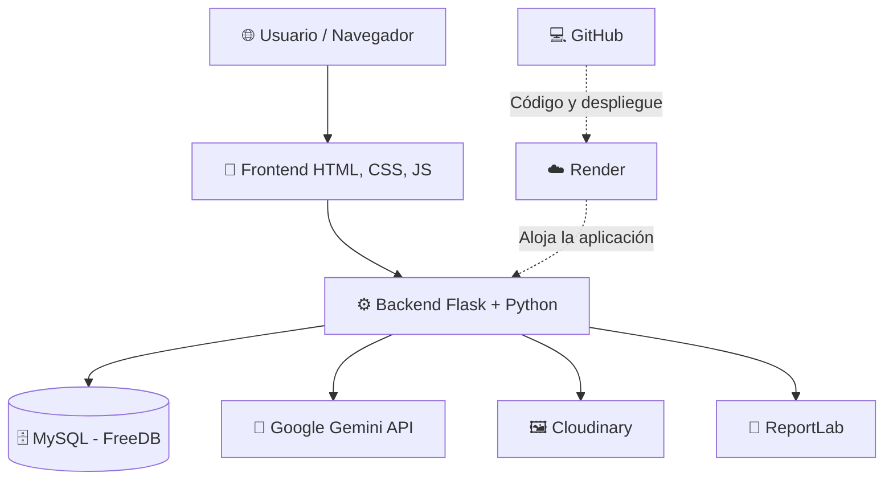
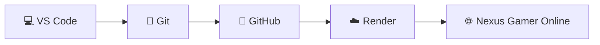

# 🎮 NEXUS GAMER
### 🕹️ Plataforma de comercio electrónico de tecnología y gaming

<p align="center">
  
  
  
  
  
</p>

<p align="center">
  <strong>🚀 Tecnología, innovación e inteligencia artificial en una sola plataforma.</strong>
</p>

<p align="center">
  <a href="https://nexus-gamer.onrender.com">🌐 Ver sitio web</a> •
  <a href="https://github.com/Luis-Villar-Vasquez/nexus-gamer">💻 Repositorio GitHub</a>
</p>

---

## 📌 Descripción del proyecto

**Nexus Gamer** es una plataforma web de comercio electrónico especializada en productos tecnológicos y gaming, desarrollada con Python, Flask y MySQL.

Integra un catálogo interactivo, carrito de compras, registro de pedidos, administración de inventario, estadísticas de ventas y un chatbot inteligente llamado **NEXUS AI**, impulsado por la API de Google Gemini.

La plataforma cuenta con una interfaz responsive, diseñada para ofrecer una experiencia cómoda desde computadoras, tablets y dispositivos móviles.

## ✨ Funcionalidades principales

| Módulo | Funcionalidades |
|---|---|
| 🛍️ Catálogo | Visualización de productos, precios, imágenes y disponibilidad |
| 🔍 Búsqueda | Búsqueda y filtros por categorías |
| 🛒 Carrito | Gestión de productos y cantidades |
| 📦 Pedidos | Registro de compras y seguimiento administrativo |
| 🤖 NEXUS AI | Consultas de productos, precios, stock y recomendaciones |
| 🔐 Administración | Acceso mediante autenticación y roles |
| 📊 Dashboard | Ingresos mensuales, productos y categorías más vendidas |
| 🧾 Documentos | Visualización y descarga de órdenes de pedido en PDF |
| 📱 Responsive | Adaptación a celulares, tablets y laptops |

---

## 🛠️ Tecnologías utilizadas

| Área | Tecnología | Aplicación |
|---|---|---|
| 🎨 Frontend | HTML5, CSS3, JavaScript | Interfaz de usuario |
| ⚙️ Backend | Python + Flask | Lógica de negocio y rutas |
| 🧩 Plantillas | Jinja2 | Renderizado dinámico |
| 🗄️ Base de datos | MySQL | Productos, clientes, usuarios y ventas |
| 🤖 Inteligencia artificial | Google Gemini API | Asistente NEXUS AI |
| 📈 Estadísticas | Chart.js | Visualización de ventas |
| ☁️ Hosting | Render | Despliegue de Flask |
| 🌐 Base de datos remota | FreeDB | Alojamiento de MySQL |
| 🖼️ Imágenes | Cloudinary | Almacenamiento de imágenes |
| 📄 PDF | ReportLab | Generación de órdenes de pedido |
| 🔄 Versionamiento | Git y GitHub | Control de versiones |

---

## 🏗️ Arquitectura del sistema



---

## 📊 Dashboard administrativo

El sistema dispone de un panel de control que permite consultar información comercial y administrar los pedidos.

### Indicadores disponibles

- 💰 Ingresos confirmados.
- 📦 Pedidos registrados y completados.
- 🛍️ Productos disponibles.
- 👥 Clientes registrados.
- 📈 Ingresos por mes.
- 🏆 Productos más vendidos.
- 🥧 Distribución de ventas por categoría.

Los gráficos son dinámicos y utilizan información almacenada en MySQL. Los ingresos confirmados consideran únicamente los pedidos completados.

### 📸 Capturas del sistema

Puedes agregar capturas reales de tu proyecto en la carpeta `docs/img/`.

**Página principal**


**Dashboard administrativo**


**Asistente NEXUS AI**


---

## 🤖 NEXUS AI — Asistente inteligente

El chatbot utiliza la API de **Google Gemini** para responder preguntas relacionadas con el catálogo de Nexus Gamer.

Entre sus principales capacidades se encuentran:

- Consultar productos disponibles.
- Informar precios y stock.
- Recomendar productos según el presupuesto.
- Identificar productos en oferta.
- Responder consultas sobre novedades.

El asistente utiliza la información del catálogo de la tienda como contexto para generar respuestas.

---

## 🚀 Despliegue del proyecto

Nexus Gamer utiliza servicios en la nube para permitir su funcionamiento en línea.

| Servicio | Función |
|---|---|
| ☁️ Render | Ejecuta la aplicación web Flask |
| 🗄️ FreeDB | Aloja la base de datos MySQL |
| 🖼️ Cloudinary | Gestiona imágenes de productos |
| 🤖 Google Gemini | Proporciona las capacidades del chatbot |
| 🐙 GitHub | Almacena el código fuente y permite actualizar el despliegue |

### Flujo de despliegue



### 🌐 Aplicación publicada

**Sitio web:** https://nexus-gamer.onrender.com

---

## 💻 Instalación local

**1. Clonar el repositorio**

```bash
git clone https://github.com/Luis-Villar-Vasquez/nexus-gamer.git
cd nexus-gamer
```

**2. Crear el entorno virtual**

```bash
python -m venv venv
```

Activar en Windows:

```bash
venv\Scripts\activate
```

**3. Instalar dependencias**

```bash
pip install -r requirements.txt
```

**4. Configurar variables de entorno**

Crear un archivo `.env` en la raíz del proyecto:

```env
SECRET_KEY=tu_clave_secreta
DB_HOST=tu_servidor_mysql
DB_PORT=3306
DB_USER=tu_usuario
DB_PASSWORD=tu_contrasena
DB_NAME=tu_base_de_datos

GEMINI_API_KEY=tu_clave_gemini

CLOUDINARY_CLOUD_NAME=tu_cloud_name
CLOUDINARY_API_KEY=tu_api_key
CLOUDINARY_API_SECRET=tu_api_secret
```

**Importante:** el archivo `.env` contiene credenciales privadas y no debe publicarse en GitHub.

**5. Ejecutar el proyecto**

```bash
python app.py
```

Abrir en el navegador:

http://127.0.0.1:5000

---

## 🔐 Seguridad

El proyecto incorpora medidas de protección como autenticación administrativa, roles de administrador y empleado, contraseñas verificadas mediante hash, protección CSRF para operaciones administrativas y variables de entorno para credenciales.

Las rutas administrativas requieren una sesión válida y los permisos correspondientes.

---

## 📁 Estructura general

```text
nexus_gamer/
│
├── app.py
├── requirements.txt
├── .env
│
├── database/
│   └── nexus_gamer.sql
│
├── templates/
│   ├── index.html
│   ├── admin_login.html
│   └── admin_dashboard.html
│
├── static/
│   ├── css/
│   ├── js/
│   └── img/
│
└── README.md
```

---

## 🎯 Objetivo del proyecto

Desarrollar una plataforma de comercio electrónico que integre gestión de productos, administración de ventas e inteligencia artificial, aplicando conocimientos de desarrollo web, bases de datos, seguridad y despliegue en la nube.

---

<p align="center">
  🎮 <strong>NEXUS GAMER</strong><br>
  Tecnología & Gaming<br>
  <em>Desarrollado con Python, Flask, MySQL y Google Gemini.</em>
</p>
